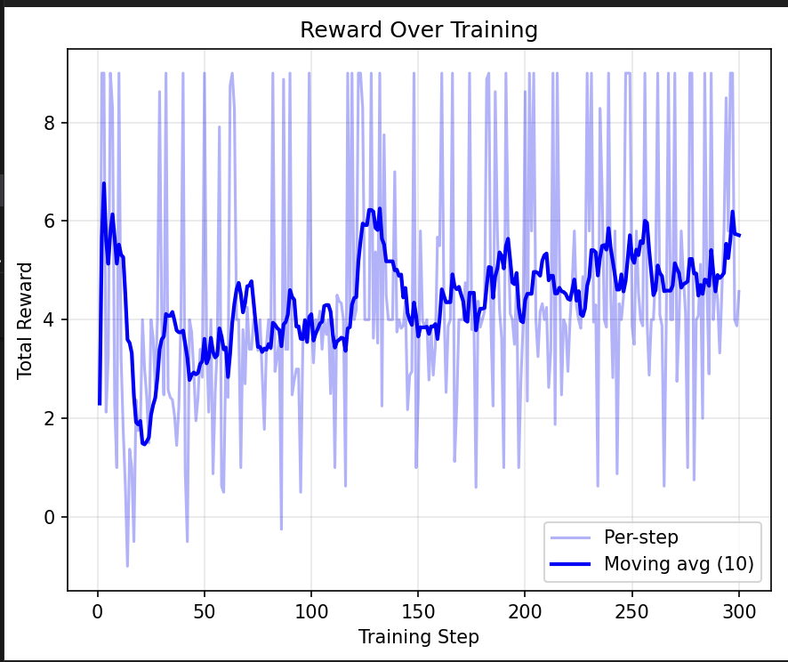

# HR Onboarding & Offboarding Environment

[](https://colab.research.google.com/github/ravi03071991/rl_hack/blob/master/train_hr_agent.ipynb)

An OpenEnv-compatible RL environment that simulates enterprise HR onboarding and offboarding workflows. The agent orchestrates across **6 enterprise apps** — Workday, ServiceNow, Okta, Email, Slack, and Calendar — using 25 tools to complete multi-step tasks in a realistic HR system (200+ employees, 8 departments, RBAC, approval chains).

Built for the [OpenEnv Hackathon SF](https://cerebralvalley.ai/e/openenv-hackathon-sf/details) — **Statement 3.1: Professional Tasks** (Scaler AI Labs partner theme: Multi-App RL Environment for Enterprise Workflows).

### Key Results

> **GRPO training on Llama 3.2-1B-Instruct improves mean task score by +67% (0.37 → 0.62).**
> Complex multi-step task scores **more than double** (0.26 → 0.68). Gains generalize to held-out test tasks.

| | Baseline | Trained | Improvement |
|---|---------|---------|-------------|
| Mean Score | 0.370 | 0.617 | **+67%** |
| Complex Tasks | 0.26 | 0.68 | **+162%** |
| Pass Rate | 15.4% | 19.2% | +3.8pp |

### Example: Complex Onboarding Task

> **Task:** "Fully onboard John Lee as L3 Team Lead in Data Science. Create employee record, assign a laptop, provision accounts, set up access roles, send welcome email, and schedule orientation."

The agent must orchestrate across all 6 apps in the correct order:

```
Step 1  [Workday]     → hr_create_employee(name="John Lee", dept="Data Science", level="L3")
Step 2  [Workday]     → onboarding_create_request(employee_id="emp_0201")
Step 3  [ServiceNow]  → it_get_available_assets(asset_type="laptop")
Step 4  [ServiceNow]  → it_assign_asset(asset_id="asset_003", employee_id="emp_0201")
Step 5  [ServiceNow]  → it_create_account(employee_id="emp_0201", account_types=["email","slack","github"])
Step 6  [Okta]        → access_assign_role(employee_id="emp_0201", role_id="ds_contributor")
Step 7  [Email]       → email_send(to="data-science@company.com", subject="Welcome John Lee!")
Step 8  [Slack]       → slack_send_message(channel="#data-science", text="Welcome John Lee...")
Step 9  [Calendar]    → meeting_schedule(title="Orientation", attendees=["emp_0201", manager])
```

**Rubric:** 10+ criteria checked — tool usage, parameter correctness, sequencing, policy compliance.

## Table of Contents

- [Quick Start](#quick-start)
- [Tools / Actions (25 MCP Tools)](#tools--actions-25-mcp-tools)
- [Tasks (77 tasks)](#tasks-77-tasks-across-4-categories)
- [World State (500+ entities)](#world-state-500-entities)
- [Reward / Rubric](#reward--rubric)
- [Environment API](#environment-api)
- [Project Structure](#project-structure)
- [Training & Results](#training--results)
- [Testing with an LLM Agent](#testing-with-an-llm-agent)
- [Installation](#installation)
- [Building & Running](#building--running)
- [Live Demo](#live-demo)

## Quick Start

```python
from rl_hack import HROnboardingAction, HROnboardingEnv

# Connect to the environment
with HROnboardingEnv(base_url="http://localhost:7860") as env:
    result = env.reset()
    print(result.observation)  # Task instruction + available tools

    # Agent calls tools to complete the task
    result = env.step(HROnboardingAction(
        tool_name="hr_create_employee",
        arguments={"name": "Priya Sharma", "department": "Engineering", "level": "L2", "role": "Software Engineer"}
    ))
    print(result.observation)  # Tool result
    print(result.reward)       # Rubric-based reward
```

## Tools / Actions (25 MCP Tools)

The agent interacts with the environment by calling these tools. Each tool modifies the world state and returns a result.

### HR System (5 tools)

| # | Tool | Description | Key Parameters |
|---|------|-------------|----------------|
| 1 | `hr_create_employee` | Create a new employee record | `name`, `department`, `level`, `role`, `manager_id`, `is_contractor` |
| 2 | `hr_read_employee` | Look up employee by ID or email | `emp_id` or `email` |
| 3 | `hr_update_employee` | Update employee fields (status, department, etc.) | `emp_id`, `updates` (dict) |
| 4 | `hr_search_employees` | Search/filter employees by criteria | `department`, `level`, `status`, `location`, `role` |
| 5 | `hr_get_org_chart` | Get reporting hierarchy for a department | `department` |

### Onboarding / Offboarding (6 tools)

| # | Tool | Description | Key Parameters |
|---|------|-------------|----------------|
| 6 | `onboarding_create_request` | Initiate onboarding for a new hire | `employee_id` |
| 7 | `onboarding_get_status` | Check onboarding progress | `request_id` or `employee_id` |
| 8 | `onboarding_complete_step` | Mark an onboarding step as done | `request_id`, `step` |
| 9 | `offboarding_create_request` | Initiate offboarding for departing employee | `employee_id`, `reason`, `exit_date` |
| 10 | `offboarding_get_status` | Check offboarding progress | `request_id` or `employee_id` |
| 11 | `offboarding_complete_step` | Mark an offboarding step as done | `request_id`, `step` |

### IT Provisioning (5 tools)

| # | Tool | Description | Key Parameters |
|---|------|-------------|----------------|
| 12 | `it_assign_asset` | Assign laptop/monitor/phone to employee | `asset_id`, `employee_id` |
| 13 | `it_get_available_assets` | List unassigned assets by type | `asset_type` (laptop, monitor, phone, headset) |
| 14 | `it_create_account` | Create email/Slack/VPN/GitHub accounts | `employee_id`, `account_types` |
| 15 | `it_revoke_access` | Revoke all IT access (for offboarding) | `employee_id` |
| 16 | `it_get_software_licenses` | Check license seat availability | `software_name` |

### Access Control (4 tools)

| # | Tool | Description | Key Parameters |
|---|------|-------------|----------------|
| 17 | `access_assign_role` | Assign RBAC role (checks level/dept restrictions) | `employee_id`, `role_id` |
| 18 | `access_create_badge` | Create physical access badge | `employee_id`, `access_zones` |
| 19 | `access_revoke_role` | Revoke a specific access role | `employee_id`, `role_id` |
| 20 | `access_get_security_groups` | List all security groups and resources | _(none)_ |

### Communication (3 tools)

| # | Tool | Description | Key Parameters |
|---|------|-------------|----------------|
| 21 | `email_send` | Send email (welcome, farewell, notifications) | `from_address`, `to_address`, `subject`, `body` |
| 22 | `slack_send_message` | Post in Slack channel or DM | `channel`, `sender`, `text` |
| 23 | `meeting_schedule` | Schedule orientation, 1-on-1, exit interview | `title`, `attendees`, `datetime`, `meeting_type` |

### Policy & Approval (2 tools)

| # | Tool | Description | Key Parameters |
|---|------|-------------|----------------|
| 24 | `policy_lookup` | Look up company policies by topic/department | `topic`, `department`, `policy_id` |
| 25 | `approval_request` | Submit approval (manager/IT/security/legal) | `request_id`, `approver_id`, `approval_type` |

## Tasks (77 tasks across 4 categories)

Each episode presents one task. The agent must call the right tools in the right order.

### Task Categories

| Category | Count | Example |
|----------|-------|---------|
| **Lookup** (simple) | 11 | "List all employees in the Engineering department" |
| **Onboarding** | 32 | "Fully onboard John Lee as L3 Team Lead in Data Science — create record, assign laptop, provision accounts, set up access, send welcome email, schedule orientation" |
| **Offboarding** | 24 | "Offboard departing director — revoke all access, reclaim assets, reassign reports, send farewell, schedule exit interview" |
| **Cross-workflow** | 10 | "Employee transferring from Engineering to Product — offboard from old dept, onboard to new" |

### Difficulty Levels

| Difficulty | Count | Tools per task | Description |
|------------|-------|---------------|-------------|
| Simple | 19 | 1-2 | Single lookups or status checks |
| Medium | 21 | 2-4 | Create + initiate workflows |
| Complex | 25 | 5-10 | Full end-to-end workflows with approvals |
| Edge case | 12 | 2-5 | Business rule violations, policy constraints |

### Edge Cases (designed to test policy compliance)

- Department at **headcount limit** — create employee should fail
- Software license **seats full** (Netsuite, LinkedIn Sales Navigator)
- Manager **on leave** — must find skip-level manager for approvals
- **Contractor** onboarding — different rules (no VPN, limited access, legal approval required)
- **Termination** vs resignation — different offboarding steps, no farewell email
- **Offer rescinded** — offboard someone mid-onboarding
- **Level mismatch** — L1 employee can't get L4+ access roles
- **Department restriction** — Marketing employee can't get Engineering GitHub role

## World State (500+ entities)

| Entity | Count | Description |
|--------|-------|-------------|
| Employees | 200 | Full org hierarchy across 8 departments (L1-L6) |
| Departments | 8 | Engineering, Product, Marketing, Sales, Finance, HR, Data Science, Security |
| IT Assets | 100 | Laptops (50), monitors (25), phones (15), headsets (10) |
| Access Roles | 20 | RBAC roles with level/department restrictions |
| Software Licenses | 15 | Jira, GitHub, AWS, Slack, Salesforce, etc. (2 intentionally full) |
| Policies | 15 | Onboarding, offboarding, badge access, contractor, termination, etc. |
| Security Groups | 15 | engineering_team, vpn_users, server_room_access, etc. |
| Message Templates | 12 | Welcome/farewell emails, Slack messages, notifications |

### RBAC Rules

- **L1** Associate → **L2** Senior → **L3** Team Lead → **L4** Manager → **L5** Director → **L6** VP
- L3+ can approve onboarding
- L4+ required for security approvals and server room badge access
- Contractors require legal approval
- Access roles have minimum level requirements and department restrictions

## Reward / Rubric

Each task has a rubric with verifiable criteria. Reward = proportion of criteria satisfied.

### Rubric Check Types

| Check | Example | What it verifies |
|-------|---------|-----------------|
| `tool_used` | `tool_used:hr_create_employee` | Tool was called at least once |
| `tool_not_used` | `tool_not_used:slack_send_message` | Tool was NOT called (e.g. no farewell for terminations) |
| `tool_used_any` | `tool_used_any:email_send,slack_send_message` | At least one of the tools was used |
| `param_value` | `param_value:hr_create_employee.name=Priya Sharma` | Tool called with specific parameter value |
| `param_contains` | `param_contains:policy_lookup.topic=onboard` | Parameter contains substring |
| `tool_order` | `tool_order:hr_create_employee<onboarding_create_request` | Tool A called before Tool B |
| `tool_count` | `tool_count:onboarding_complete_step>=3` | Tool called at least N times |
| `result_contains` | `result_contains:headcount_limit` | Any tool result contains substring |

### Example Rubric (medium task)

Task: "Onboard Priya Sharma to Engineering as L2 Software Engineer"

| Criterion | Check |
|-----------|-------|
| Created employee record | `tool_used:hr_create_employee` |
| Correct name | `param_value:hr_create_employee.name=Priya Sharma` |
| Correct department | `param_value:hr_create_employee.department=Engineering` |
| Correct level | `param_value:hr_create_employee.level=L2` |
| Correct role | `param_value:hr_create_employee.role=Software Engineer` |
| Initiated onboarding | `tool_used:onboarding_create_request` |
| Correct sequencing | `tool_order:hr_create_employee<onboarding_create_request` |

**Score**: 7/7 = 1.0 (pass) or partial (e.g. 5/7 = 0.71)

## Environment API

### OpenEnv Interface (MCPEnvironment)

```
reset()  → Observation   # Pick task, reset world state, return instruction
step()   → Observation   # Agent calls a tool, get result + reward
state    → State         # Current step count, episode ID
```

### Episode Flow

```
1. env.reset()
   → Task: "Fully onboard John Lee as L3 Team Lead..."

2. Agent calls: hr_create_employee(name="John Lee", department="Data Science", level="L3", ...)
   → env.step() → {"success": true, "emp_id": "emp_0201"}

3. Agent calls: onboarding_create_request(employee_id="emp_0201")
   → env.step() → {"success": true, "request_id": "onb_0001", "steps": {...}}

4. Agent calls: it_get_available_assets(asset_type="laptop")
   → env.step() → {"success": true, "assets": [...]}

5. Agent calls: it_assign_asset(asset_id="asset_003", employee_id="emp_0201")
   → env.step() → {"success": true}

   ... more tool calls ...

N. Episode ends (max 15 steps or agent signals done)
   → Reward: 8/10 criteria satisfied = 0.8
```

## Project Structure

```
rl_hack/
├── README.md                          # This file
├── openenv.yaml                       # OpenEnv manifest
├── pyproject.toml                     # Project metadata
├── __init__.py                        # Module exports
├── client.py                          # HROnboardingEnv client
├── models.py                          # Action/Observation Pydantic models
├── test_with_llm.py                   # Test single task with GPT agent
├── test_all_tasks.py                  # Evaluate all 77 tasks
├── train_hr_agent.ipynb               # GRPO training notebook (Unsloth)
├── .env                               # API keys (gitignored)
├── outputs/                           # Evaluation results
└── server/
    ├── __init__.py
    ├── app.py                         # FastAPI application
    ├── hr_onboarding_environment.py   # Core environment (Environment subclass)
    ├── world.py                       # World state (entities, RBAC, mutations)
    ├── tools.py                       # Tool registry (25 tools)
    ├── tasks.py                       # Task definitions + generation (77 tasks)
    ├── rubrics.py                     # Rubric evaluator (reward computation)
    ├── data/
    │   ├── employees.json             # 200 employee records
    │   ├── departments.json           # 8 departments with policies
    │   ├── policies.json              # 15 business rule documents
    │   ├── it_assets.json             # 100 IT assets
    │   ├── access_roles.json          # 20 RBAC roles
    │   └── templates.json             # 12 message templates
    ├── Dockerfile                     # Container image
    └── requirements.txt               # Server dependencies
```

## Testing with an LLM Agent

You can test the environment locally using GPT (or any OpenAI-compatible model) as the agent.

### Setup

1. Create a `.env` file in the repo root:
   ```
   OPENAI_API_KEY="sk-proj-..."
   ```

2. Install dependencies:
   ```bash
   uv pip install -e ".[eval]"
   ```

### Run

```bash
cd rl_hack

# Test on default task (simple lookup)
uv run python -m test_with_llm

# Test a specific task by index (0-76)
uv run python -m test_with_llm 14    # medium onboarding task
uv run python -m test_with_llm 24    # complex full onboarding
uv run python -m test_with_llm 55    # edge case (headcount limit)

# Run full evaluation across all 77 tasks
uv run python test_all_tasks.py
```

The script will:
- Reset the environment and pick a task
- Use GPT-4o-mini to generate tool calls
- Execute each tool call against the environment
- Print the rubric evaluation with pass/fail per criterion

### Example Output

```
Task ID: task_0015
Difficulty: medium
Instruction: Onboard new hire Priya Sharma to Engineering as L2 Software Engineer...

--- Step 1/15 ---
LLM: {"tool": "hr_create_employee", "params": {"name": "Priya Sharma", ...}}
  Tool: hr_create_employee
  Result: {"success": true, "employee": {"emp_id": "emp_0201", ...}}

--- Step 2/15 ---
LLM: {"tool": "onboarding_create_request", "params": {"employee_id": "emp_0201"}}
  Tool: onboarding_create_request
  Result: {"success": true, ...}

FINAL EVALUATION
Score: 100% (7/7 criteria)
Passed: True
  [PASS] created_employee
  [PASS] correct_name
  [PASS] correct_dept
  [PASS] initiated_onboarding
  [PASS] sequencing
```

### Task Index Reference

| Index | Difficulty | Category | Description |
|-------|-----------|----------|-------------|
| 0-13 | Simple | Lookup/Onboarding | Single lookups, status checks |
| 14-23 | Medium | Onboarding | Create employee + initiate workflow |
| 24-34 | Complex | Onboarding | Full end-to-end with IT, access, comms |
| 35-46 | Medium | Offboarding | Initiate offboarding + revoke access |
| 47-54 | Complex | Offboarding | Full offboarding with asset reclaim |
| 55-66 | Edge case | Various | Headcount limits, license caps, RBAC |
| 67-76 | Complex | Cross-workflow | Transfers, rehires, manager departures |

## Installation

```bash
# Clone the repo
git clone https://github.com/ravi03071991/rl_hack.git
cd rl_hack

# Install core dependencies
uv pip install -e .

# Install with evaluation support (adds openai)
uv pip install -e ".[eval]"

# Install with training support (adds unsloth, trl, torch, etc.)
uv pip install -e ".[train]"

# Install everything
uv pip install -e ".[eval,train,dev]"
```

## Building & Running

```bash
# Run locally (as OpenEnv HTTP server with playground UI)
uvicorn server.app:app --reload --host 0.0.0.0 --port 7860

# Build Docker image
docker build -t hr-onboarding-env:latest -f server/Dockerfile .

# Deploy to HF Spaces
openenv push
```

## Training & Results

We use Unsloth + GRPO to train an LLM agent on this environment. See [`train_hr_agent.ipynb`](train_hr_agent.ipynb) for the full training notebook and [W&B run](https://wandb.ai/ravi03071991/hr-agent-training/runs/bgent3o3?nw=nwuserravi03071991) for live training metrics.

### Setup

- **Model**: Llama 3.2-1B-Instruct (4-bit quantized, LoRA rank 8)
- **Algorithm**: GRPO (Group Relative Policy Optimization)
- **Reward functions** (3 components, total range -4.0 to +9.0):
  - **Valid JSON** (-2.0 to +1.0): Penalizes malformed tool calls, rewards valid JSON with correct tool name
  - **Rubric score** (-1.0 to +7.0): Checks task-specific criteria (tool usage, parameter values, sequencing, policy compliance)
  - **Efficiency** (-1.0 to +1.0): Rewards completing tasks in fewer steps, penalizes unnecessary tool calls
- **Training**: 300 steps, 6 generations per prompt, lr=5e-5 with cosine schedule
- **Data split**: 70/30 stratified train/test (52 train, 25 test tasks)

### Results

GRPO training significantly improves the model's ability to complete HR workflows:

| Metric | Base Model | Trained | Change |
|--------|-----------|---------|--------|
| **Train pass rate** | 15.4% | 19.2% | +3.8% |
| **Train mean score** | 0.370 | 0.617 | **+0.247 (+67%)** |
| **Test pass rate** | 12.0% | 16.0% | +4.0% |
| **Test mean score** | 0.370 | 0.617 | **+0.247 (+67%)** |

#### Improvement by difficulty

| Difficulty | Baseline | Trained | Change |
|------------|----------|---------|--------|
| Simple | 0.23 | 0.50 | +0.27 |
| Medium | 0.72 | 0.86 | +0.14 |
| **Complex** | **0.26** | **0.68** | **+0.42** |
| Edge case | 0.22 | 0.25 | +0.03 |

The biggest gains are on **complex multi-step tasks** — scores more than doubled. The improvement **generalizes to held-out test tasks**, proving the model learned transferable HR workflow skills.

### Reward Curve



The moving average reward trends upward from ~2-3 early in training to ~4-5 by the end, showing consistent learning.

### Quick start (Colab)

1. Click the Colab badge at the top to open `train_hr_agent.ipynb` in Google Colab
2. Select a GPU runtime
3. Run all cells — installs dependencies, trains, and evaluates automatically

## Live Demo

Try the environment on Hugging Face Spaces: https://huggingface.co/spaces/devxpy/rl_hack
